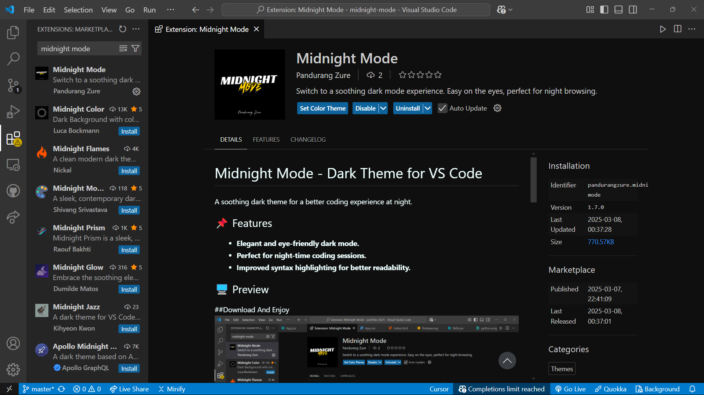

<!-- # Midnight Mode Theme

## Working with Markdown

You can author your README using Visual Studio Code. Here are some useful editor keyboard shortcuts:

* Split the editor (`Cmd+\` on macOS or `Ctrl+\` on Windows and Linux).
* Toggle preview (`Shift+Cmd+V` on macOS or `Shift+Ctrl+V` on Windows and Linux).
* Press `Ctrl+Space` (Windows, Linux, macOS) to see a list of Markdown snippets.

## For more information

* [Visual Studio Code's Markdown Support](http://code.visualstudio.com/docs/languages/markdown)
* [Markdown Syntax Reference](https://help.github.com/articles/markdown-basics/)

**Enjoy!** -->

#Midnight Mode - Dark Theme for VS Code

##A soothing dark theme for a better coding experience at night.

📌 Features

*Elegant and eye-friendly dark mode.

*Perfect for night-time coding sessions.

*Improved syntax highlighting for better readability.

🖥️ Preview

*Code Editor View

📥 Installation

Open VS Code.

Go to Extensions (Ctrl + Shift + X).

Search for "Midnight Mode".

Click Install.

Go to Settings > Color Theme (Ctrl + K + T) and select Midnight Mode.

🚀 Manual Installation

Download the .vsix file from the Releases.

Open VS Code and go to Extensions.

Click ... (More Actions) > Install from VSIX.

Select the downloaded .vsix file and install.

🔧 Configuration

No additional setup is required. Just install and enjoy the Midnight Mode experience! 🎨

🛠️ Contributing

Want to improve the theme? Contributions are welcome! Fork the repository and submit a pull request.

📄 License

This project is licensed under the ISC License.

📞 Support & Feedback

Issues: Report Here

GitHub Repository: Midnight Mode on GitHub