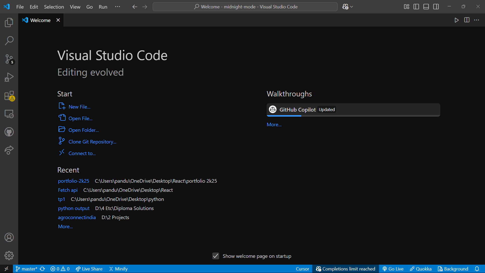
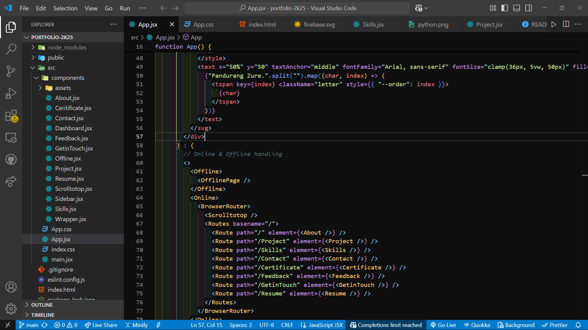

# Midnight Mode - Dark Theme for VS Code

 A soothing dark theme for a better coding experience at night.

## 📌 Features

- **Elegant and eye-friendly dark mode.**
- **Perfect for night-time coding sessions.**
- **Improved syntax highlighting for better readability.**

## 🖥️ Preview

Download And Enjoy  

Code Editor View

## 📥 Installation

1. Open VS Code.
2. Go to **Extensions** (Ctrl + Shift + X).
3. Search for **"Midnight Mode"**.
4. Click **Install**.
5. Go to **Settings > Color Theme** (Ctrl + K, T) and select **Midnight Mode**.

## 🚀 Manual Installation

1. Download the `.vsix` file from the **Releases**.
2. Open VS Code and go to **Extensions**.
3. Click **... (More Actions) > Install from VSIX**.
4. Select the downloaded `.vsix` file and install.

## 🔧 Configuration

No additional setup is required. Just install and enjoy the **Midnight Mode** experience! 🎨

## 🛠️ Contributing

Want to improve the theme? Contributions are welcome! Fork the repository and submit a pull request.

## 📄 License

This project is licensed under the terms of the ISC License. See the [LICENSE](https://github.com/PANDURANGZURE/midnight-mode-vs-code-Extention/blob/master/LICENSE.txt) file for details.

## 📞 Support & Feedback

- **Issues**: [Report Here](https://github.com/PANDURANGZURE/midnight-mode-vs-code-Extention/issues)
- **Issues**: [Report Here](https://github.com/PANDURANGZURE/midnight-mode-vs-code-Extention/issues)
- **GitHub Repository**: [Midnight Mode on GitHub](https://github.com/PANDURANGZURE/midnight-mode-vs-code-Extention)

##

Enjoy! this theme